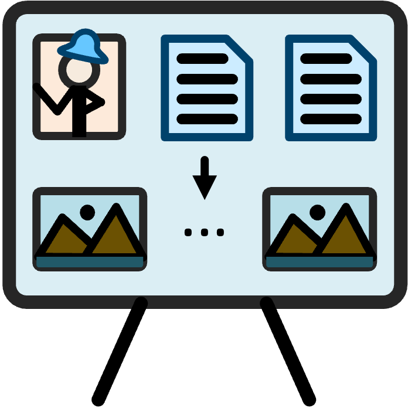

<div align="center">
  
</div>
<p align="center">
  <h1 align="center"><strong>ViStoryBench: Comprehensive Benchmark Suite<br> for Story Visualization</strong></h1>
<p align="center">

<div align="center">
  <a href="https://vistorybench.github.io/"></a> &ensp;
  <a href="https://arxiv.org/abs/xxxx.xxxxx"></a> &ensp;
  <a href="https://huggingface.co/datasets/ViStoryBench/ViStoryBench"></a> &ensp;
  <a href="https://vistorybench.github.io/story_detail/"></a> &ensp;
</div>


# Overview

https://github.com/user-attachments/assets/19b17deb-416a-400a-b071-df21ba58f4b7
<p><b>ViStoryBench</b> introduces a comprehensive and diverse benchmark for story visualization, enabling thorough evaluation of models across narrative complexity, character consistency, and visual style.</p>


# Usage

## Download
```bash
git clone --recursive
cd ViStoryBench
```
## Environment
```bash
conda create -n storyvisbmk python=3.11
conda activate storyvisbmk

conda install pytorch==2.4.0 torchvision==0.19.0 torchaudio==2.4.0 pytorch-cuda=12.4 -c pytorch -c nvidia

pip install -r requirements.txt
```

## 1. Dataset Preparation

### 1.1. About ViStory Dataset🐻

**80** stories and **344** characters, both *Chinese* and *English*,

Each story included **Plot Correspondence**, **Setting Description**, **Shot Perspective Design**, **Characters Appearing** and **Static Shot Description**

Each character included at least one **inference image** and corresponding **prompt description**.


### 1.2. Download...
📥 Download our [ViStory Datasets](https://huggingface.co/datasets/ViStoryBench/ViStoryBench) (🤗huggingface) and put it into your local path
```bash
</path/to/your/dataset>
# example
./data/dataset/ViStory/
```


## 2. Dataset Adaptation 
### 2.1. Loading Dataset
Use our standardized loading script 
[`dataset_load.py`](https://github.com/ViStoryBench/vistorybench/blob/main/code/data_process/dataset_process/dataset_load.py) or your own data loader 

```bash
pyhton code/data_process/dataset_process/dataset_load.py
```


### 2.2. Adapting and Running


Based on [`dataset_load.py`](https://github.com/ViStoryBench/vistorybench/blob/main/code/data_process/dataset_process/dataset_load.py), convert ViStory/ViStory-lite dataset to your method's required input format (converted dataset will be saved to `/data/dataset_processed/your_method_name/`) and modify the inference code for story visualization (suggest generated results save to `/data/outputs/your_method_name/`).

**Example of UNO:**
```bash
python code/data_process/dataset_process/adapt2uno.py \
--language 'en' # choice=['en','ch']
```

**Other Methods:**
- `adapt2seedstory.py`,
- `adapt2storyadapter.py`,
- `adapt2storydiffusion.py`,
- `adapt2storygen.py`,
- `adapt2vlogger.py`,
- `adapt2animdirector.py`


## 3. Generated-Results Reading

### 3.1 Output Structure
Make sure your output results are organized according to the following folder structure:
```
data/outputs/
└── method_name/
    └── dataset_name/
        └── story_id/
            └── timestamp/
                ├── shot_XX.jpg
                └── ...
```

- `method_name`: The model used (e.g., StoryDiffusion, UNO, GPT4o, etc.)
- `dataset_name`: The dataset used (e.g., ViStory_en)
- `story_id`: The story identifier (e.g., 01, 02, etc.)
- `timestamp`: Generation run timestamp (YYYYMMDD-HHMMSS)
- `shot_XX.jpg`: Generated image for the shot

### 3.2 Automated Reading
When you run the evaluation code, it will automatically perform data reading (ensure both the ViStoryBench dataset and the generated results conform to the standard directory structure specified above). The generated-results reading code has been uniformly integrated into the following file:
`code/data_process/outputs_read/read_outputs.py`


## 4. Evaluation! 🐻
**Example of UNO:**
```bash
cd code/bench
sh bench_run.sh 'uno' # Run it for data integrity check
sh bench_run.sh 'uno' --all # Run it for all evaluation
sh bench_run.sh 'uno' --cref # Run it for content consistency eval
sh bench_run.sh 'uno' --cref --csd_cross --csd_self # Run it for both content and style consistency eval
sh bench_run.sh 'uno' --save_format # Run it to standardize the generated-results file structure.
```

### All metrics are as follow:
`--cref`
`--csd_cross`
`--csd_self`
`--aesthetic`
`--prompt_align2`
`--diversity`

### All methods are as follow:
```bash
STORY_IMG = ['uno', 'seedstory', 'storygen', 'storydiffusion', 'storyadapter', 'theatergen']
STORY_VIDEO = ['movieagent', 'animdirector', 'vlogger', 'mmstoryagent']
CLOSED_SOURCE = ['gemini', 'gpt4o']
BUSINESS = ['moki', 'morphic_studio', 'bairimeng_ai', 'shenbimaliang', 'xunfeihuiying', 'doubao']
```

## Citation
```bibtex
@article{zhuang2025vistorybench,
  title={ViStoryBench: Comprehensive Benchmark Suite for Story Visualization}, 
  author={Cailin Zhuang, Ailin Huang, Wei Cheng, Jingwei Wu, Yaoqi Hu, Jiaqi Liao, Zhewei Huang, Hongyuan Wang, Xinyao Liao, Weiwei Cai, Hengyuan Xu, Xuanyang Zhang, Xianfang Zeng, Gang Yu, Chi Zhang},
  journal={arXiv preprint arxiv:xxxx.xxxxx}, 
  year={2025}
}
```
