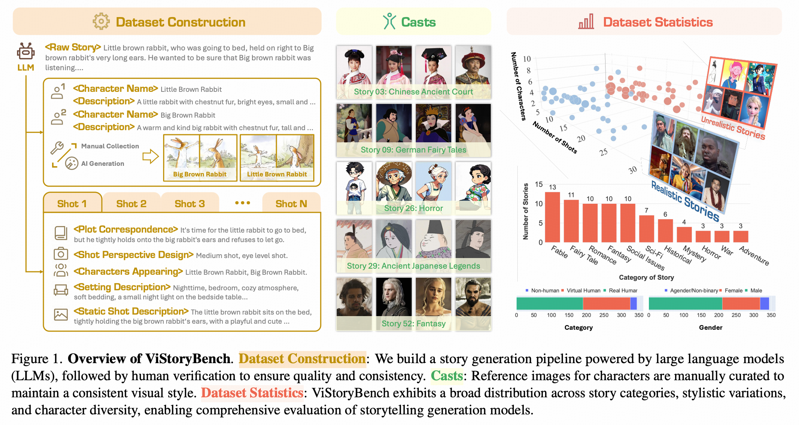

# <span style="color: orange">ViStoryBench</span>: A Comprehensive Benchmark Suite for Story Visualization

 <a href="https://vistorybench.github.io/"></a> &ensp;
  <a href="https://arxiv.org/abs/2505.24862"></a> &ensp;
  <a href="https://huggingface.co/datasets/ViStoryBench/ViStoryBench"></a> &ensp;
  <a href="https://vistorybench.github.io/story_detail/"></a> &ensp;
<!--  -->


<p><b>ViStoryBench</b> introduces a comprehensive and diverse benchmark for story visualization, enabling thorough evaluation of models across narrative complexity, character consistency, and visual style.</p>

https://github.com/user-attachments/assets/19b17deb-416a-400a-b071-df21ba58f4b7

## 🚩 Latest Updates
- [ ] **[2025]** 🏆 Ongoing leaderboard maintenance and evaluation of new story visualization methods.
- [x] **[2025.08.19]** 🛠️ Major code v1 update: Full benchmark implementation released.
- [x] **[2025.08.12]** 📄 arXiv v3 is now available.
- [x] **[2025.06.25]** 📄 arXiv v2 has been published.
- [x] **[2025.05.30]** 📝 Technical report v1 released on arXiv.
- [x] **[2025.05.21]** 🚀 Initial project launch and code release.

## 🏛️ Architecture & Contribution
ViStoryBench is designed with a modular and extensible architecture. The core of our evaluation pipeline is the `BaseEvaluator` abstract class, which allows for easy integration of new evaluation metrics.

**Adding a New Evaluator:**
1. Create a new class that inherits from `vistorybench.bench.base_evaluator.BaseEvaluator`.
2. Implement the required methods (`__init__`, `evaluate`).
3. Register your new evaluator in `vistorybench/bench_run.py`.

We welcome contributions from the community! If you have a new metric or an improvement, please feel free to submit a pull request.

## 🛠️ Setup

### Download
```bash
git clone --recursive https://github.com/ViStoryBench/vistorybench.git
cd vistorybench
```
### Environment
```bash
conda create -n vistorybench python=3.11
conda activate vistorybench

# for cuda 12.4
conda install pytorch==2.4.0 torchvision==0.19.0 torchaudio==2.4.0 pytorch-cuda=12.4 -c pytorch -c nvidia
# for cuda 12.1
pip install torch==2.2.1 torchvision==0.17.1 torchaudio==2.2.1 --index-url https://download.pytorch.org/whl/cu121
# for cuda 11.8
pip install torch==2.2.1 torchvision==0.17.1 torchaudio==2.2.1 --index-url https://download.pytorch.org/whl/cu118

pip install -r requirements.txt
```
Choose the torch version that suits you on this website:
https://pytorch.org/get-started/previous-versions/

## 🚀 Usage

## <span style="color: orange">1. Dataset Preparation🐻</span>

### 1.1. About ViStory Dataset

> **80** stories and **344** characters, both *Chinese* and *English*,
>
>Each story included **Plot Correspondence**, **Setting Description**, **Shot Perspective Design**, **On-Stage Characters** and **Static Shot Description**
>
>Each character included at least one **inference image** and corresponding **prompt description**.


### 1.2. Dataset Downloading...

We provide an automated dataset download script that allows you to download full ViStory Dataset with a single command:
```bash
cd ViStoryBench
sh download_dataset.sh
```
Alternatively, you can download it by following these steps:

📥 Download our [ViStory Datasets](https://huggingface.co/datasets/ViStoryBench/ViStoryBench) (🤗huggingface) 
and save it in `data/dataset`.
* If you use a custom path, please full `dataset_path` in `vistorybench/config.yaml`.

<!-- ```python
from huggingface_hub import snapshot_download
snapshot_download(
    repo_id="ViStoryBench/ViStoryBench",
    repo_type="dataset",
    local_dir="data/dataset",
    local_dir_use_symlinks=False
)
``` -->
After the download is complete, please rename the `​​ViStoryBench​`​ folder to ​​`ViStory​`​.
Folder structure of **ViStory Datasets**:
```
data/dataset/
├── ViStory/ # rename ‘​​ViStoryBench​’​ to ​​‘ViStory​’
│   ├── 01/
│   │   ├── image/
│   │   │   └── Big Brown Rabbit/
│   │   │       ├── 00.jpg
│   │   │       └── ...
│   │   └── story.json
│   └── 02/
│       └── ...
└── ...
```

## <span style="color: orange">2. Inference on ViStory Dataset</span>

### 2.1. Dataset Loading
Use our standardized loading script 
`dataset_load.py` or your own data loader.
Run this command to verify successful dataset loading:
```bash
pyhton vistorybench/dataset_loader/dataset_load.py
```

### 2.2. Dataset Adapting 

> Aligning the dataset format with the specified method's input requirements.

Pre-built dataset conversion scripts are available for several pre-defined methods, all located in `vistorybench/dataset_loader`. `adapt_base.py` is a template script for dataset conversion. All pre-built dataset conversion scripts are created based on this template.
- `adapt_base.py`
- `adapt2animdirector.py`
- `adapt2seedstory.py`,
- `adapt2storyadapter.py`,
- `adapt2storydiffusion.py`,
- `adapt2storygen.py`,
- `adapt2uno.py`,
- `adapt2vlogger.py`,

**Example of UNO:**
```bash
python vistorybench/dataset_loader/adapt2uno.py \
--language 'en' # choice=['en','ch']
```

You can create a script to convert the ViStory/ViStory-lite dataset into your method's required input format (Based on template script `adapt_base.py`).
* The converted dataset will be saved to `data/dataset_processed`. 
* If you use a custom path, please full `processed_dataset_path` in `vistorybench/config.yaml`

### 2.3. Inference custom

Pre-modify inference scripts of several pre-defined methods are available for reference, all located in `vistorybench/data_process/inference_custom`.
- `movieagent/run_custom.py`
- `seedstory/vis_custom_sink.py`
- `storyadapter/run_custom.py`
- `storydiffusion/gradio_app_sdxl_specific_id_low_vram_custom.py`
- `storygen/inference_custom_mix.py`
- `storygen/inference_custom.py`
- `uno/inference_custom.py`
- `vlogger/vlog_read_script_sample_custom.py`

You can modify your method's story visualization inference scripts according to the specified requirements. 
* We suggest saving generated results to `data/outputs`.
* If you use a custom path, please full `outputs_path` in `vistorybench/config.yaml`

> **SD Embed**. Our ViStory Dataset contains extensive complex text descriptions. However, not all models support long-text inputs. To overcome the 77-token prompt limitation in Stable Diffusion, we utilize [sd_embed](https://github.com/xhinker/sd_embed) to generate long-weighted prompt embeddings for lengthy text.


## <span style="color: orange">3. Generated-Results Reading</span>

### 3.1 Output Structure
Make sure your generated results are organized according to the following folder structure:
```
data/outputs/
├── method_name/
│   └── mode_name/
│       └── language_name/
│           └── timestamp/
│               ├── shots/
│                 ├── story_id/
│                 │   ├── shot_XX.png
│                 │   └── ...
│                 └── 02/
│                     └── ...
└── method_2/
    └── ...
```

- `method_name`: The model used (e.g., StoryDiffusion, UNO, GPT4o, etc.)
- `mode_name`: The mode used of method(e.g., base, SD3, etc.)
- `language_name`: The language used (e.g., en, ch)
- `timestamp`: Generation run timestamp (YYYYMMDD_HHMMSS) (e.g., 20250000_111111)
- `story_id`: The story identifier (e.g., 01, 02, etc.)
- `shot_XX.jpg`: Generated image for the shot

**Example of UNO:**
```
data/outputs/
├── uno/
│   └── base/
│       └── en/
│           └── 20250000-111111/
│               ├── shots/
│                 ├── 01/
│                 │   ├── 00.png
│                 │   └── ...
│                 └── 02/
│                     └── ...
└── method_2/
    └── ...
```
**Example of your method:**
```
data/outputs/
├── method_1/
│   └── mode_1/
│       └── language_1/
│           └── 20250000-111111/
│               ├── 01/
│               │   ├── shots
│               │     ├── 00.png
│               │     └── ...
│               └── 02/
│                   └── ...
└── method_2/
    └── ...
```

### 3.2 Automated Reading
When you run the evaluation code, it will automatically perform data reading (ensure both the ViStoryBench dataset and the generated results conform to the standard directory structure specified above). The generated-results reading code has been uniformly integrated into the following file:
`vistorybench/dataset_loader/read_outputs.py`


## <span style="color: orange">4. Evaluation & Analysis</span> 😺

### 4.1 Download Weights

We provide an automated pretrain-weight download script that allows you to download all the following weights with a single command. 
```bash
sudo apt update
sudo apt install aria2
snap install yq
sh download_weights.sh
```
* All of them will be saved in `data/pretrain`.
* If you use a custom path, please full `pretrain_path` in `vistorybench/config.yaml`.

Alternatively, you can download them separately by following these steps:

---
#### For `CIDS Score` and `Prompt Align Score`:
* **a. GroundingDINO weights**. Download `groundingdino_swint_ogc.pth` weights from [here](https://github.com/IDEA-Research/GroundingDINO/releases/download/v0.1.0-alpha/groundingdino_swint_ogc.pth).
Save it in the `data/pretrain/groundingdino/weights` folder (Please create it in advance).
<!-- ```bash
wget -P data/pretrain/groundingdino/weights https://github.com/IDEA-Research/GroundingDINO/releases/download/v0.1.0-alpha/groundingdino_swint_ogc.pth
``` -->

* **b. InsightFace antelopev2**. Download `antelopev2.zip` from [here](https://github.com/deepinsight/insightface/releases/tag/v0.7).
Unzip it and save them in the `data/pretrain/insightface/models/antelopev2` folder (Please create it in advance).

* **c. SigLIP weights**. Download [siglip-so400m-patch14-384](https://huggingface.co/google/siglip-so400m-patch14-384) 🤗 weights.
Save them in the `/data/pretrain/google/siglip-so400m-patch14-384` folder (Please create it in advance).
<!-- ```python
from huggingface_hub import snapshot_download
snapshot_download(
    repo_id="google/siglip-so400m-patch14-384",
    repo_type="model",
    local_dir="data/pretrain/google/siglip-so400m-patch14-384",
    local_dir_use_symlinks=False
)
``` -->

* **d. BERT weights**. Download [bert-base-uncased](https://huggingface.co/google-bert/bert-base-uncased) 🤗 weights.
Save them in the `data/pretrain/google-bert/bert-base-uncased` folder (Please create it in advance).
<!-- ```python
from huggingface_hub import snapshot_download
snapshot_download(
    repo_id="google-bert/bert-base-uncased",
    repo_type="model",
    local_dir="data/pretrain/google-bert/bert-base-uncased",
    local_dir_use_symlinks=False
)
``` -->

* **e. AdaFace weights**. Download `adaface_ir101_webface12m.ckpt` weights from [here](https://drive.google.com/file/d/1dswnavflETcnAuplZj1IOKKP0eM8ITgT/view).
Save it in the `/data/pretrain/adaface` folder (Please create it in advance).

* **f. Facenet vggface2**. Download `vggface2` automatically during initial execution.

* **g. Facexlib weights**. Download `detection_Resnet50_Final.pth` from [here](https://github.com/xinntao/facexlib/releases/download/v0.1.0/detection_Resnet50_Final.pth) to `.../facexlib/weights/detection_Resnet50_Final.pth` and `parsing_parsenet.pth` from [here](https://github.com/xinntao/facexlib/releases/download/v0.2.2/parsing_parsenet.pth) to `.../facexlib/weights/parsing_parsenet.pth` automatically during initial execution. 


---
#### For `CSD Score`:

* **CSD weights**. Download `csd_vit-large.pth` weights from [here](https://drive.google.com/file/d/1SETgjkj6oUIbjgwxgtXw2I2t4quRzG-3/view?usp=drive_link).
Save it in the `/data/pretrain/csd` folder (Please create it in advance).


---
#### For `Aesthetic Score`:
* **Aesthetic predictor weights**. Download `aesthetic_predictor_v2_5.pth` weights from [here](https://github.com/discus0434/aesthetic-predictor-v2-5/raw/main/models/aesthetic_predictor_v2_5.pth).
Save it in the `/data/pretrain/aesthetic_predictor` folder (Please create it in advance).
<!-- ```bash
wget -P /data/pretrain/aesthetic_predictor https://github.com/discus0434/aesthetic-predictor-v2-5/raw/main/models/aesthetic_predictor_v2_5.pth
``` -->
---
#### For `Inception Score`
* **Inception weights**. Download `inception_v3_google-0cc3c7bd.pth` automatically during initial execution.

---
### 4.2. Running Evaluation
Navigate to the source code directory:
```bash
cd vistorybench
```

**Example Command:**
```bash
# Run all available metrics for the 'uno' method in English
python bench_run.py --method uno --language en

# Run only the CIDS and CSD metrics for 'uno'
python bench_run.py --method uno --metrics cids csd --language en

# Run all metrics for a specific timestamp
python bench_run.py --method uno --language en --timestamp 20250824_141800
```

#### ⭐️ Key Parameters:
- `--method` (Required): Specify the method (model) to evaluate (e.g., `uno`, `storydiffusion`).
- `--metrics` (Optional): A space-separated list of metrics to run (e.g., `cids`, `csd`, `aesthetic`). If omitted, all registered evaluators will be executed.
- `--language` (Required): The language of the dataset to evaluate (`en` or `ch`).
- `--timestamp` (Optional): Specify a particular generation run to evaluate. If omitted, the latest run will be used.
- `--mode` (Optional): Mode name for the method (e.g., `base`). Used to locate outputs under `outputs/<method>/<mode>/<language>/<timestamp>/`.
- `--resume` (Optional, default: True):
  - True: Use the specified `--timestamp` or the latest available timestamp.
  - False: Create a new timestamp under results and write evaluation outputs there.
- `--dataset_path`, `--outputs_path`, `--pretrain_path`, `--result_path` (Optional): Override core paths for dataset, generated outputs, pretrain weights, and evaluation results. Defaults come from YAML `core.paths` or built-in defaults.
- `--api_key` (Optional): API key for PromptAlign GPT calls. If omitted, the evaluator reads from the environment variable `VISTORYBENCH_API_KEY`.
- `--base_url`, `--model_id` (Optional): Override PromptAlign GPT endpoint and model ID for this run. These values override YAML `evaluators.prompt_align.gpt.base_url` / `model` at runtime.

Note:
- Minimal YAML must include `core.runtime.device` (e.g., `cuda` or `cpu`).
- PromptAlign optional config lives under `evaluators.prompt_align.gpt` (`model`, `base_url`). CLI `--model_id`/`--base_url` override these per-run without changing the YAML.
#### ✅ Minimal config.yaml (required fields)

Your config.yaml should be minimal and explicit. At minimum, specify device under core.runtime. Paths can remain defaults or be customized here.

```yaml
core:
  paths:
    dataset: data/dataset
    outputs: data/outputs
    pretrain: data/pretrain
    results: data/bench_results
  runtime:
    device: cuda  # or cpu

evaluators:
  prompt_align:
    gpt:
      model: gpt-4.1           # optional override
      base_url: https://api.openai.com  # optional override
# Optional: CIDS knobs (uncomment to override defaults)
#  cids:
#    ref_mode: origin
#    use_multi_face_encoder: false
#    ensemble_method: average
#    detection:
#      dino:
#        box_threshold: 0.25
#        text_threshold: 0.25
#    encoders:
#      clip:
#        model_id: openai/clip-vit-large-patch14
#    matching:
#      superfluous_threshold: 0.8
#      topk_per_nochar: 5
#    ensemble_weights:
#      arcface: 0.4
#      adaface: 0.4
#      facenet: 0.2
```

Notes:
- core.runtime.device is required at runtime; the tool will exit if missing.
- PromptAlign API key is read from env var VISTORYBENCH_API_KEY or via --api_key.
- CLI --base_url and --model_id override evaluators.prompt_align.gpt.base_url/model per run without changing YAML.

#### ⭐️ The pre-defined methods include:
```python
STORY_IMG = ['uno', 'seedstory', 'storygen', 'storydiffusion', 'storyadapter', 'theatergen']
STORY_VIDEO = ['movieagent', 'animdirector', 'vlogger', 'mmstoryagent']
CLOSED_SOURCE = ['gemini', 'gpt4o']
BUSINESS = ['moki', 'morphic_studio', 'bairimeng_ai', 'shenbimaliang', 'xunfeihuiying', 'doubao']
```

### 4.3. Results Structure
After running the evaluation, the results will be stored in the `data/bench_results` directory with the following structure:

```
data/bench_results/
└── method_name/
    └── mode_name/
        └── language_name/
            └── YYYYMMDD_HHMMSS/
                ├── summary.json
                ├── metadata.json
                ├── cids/
                │   ├── cids_results.json
                │   └── ...
                ├── csd/
                │   ├── csd_self_results.json
                │   └── csd_cross_results.json
                └── ... (other metrics)
```

- **`summary.json`**: Contains the averaged scores for all metrics.
- **`metadata.json`**: Stores metadata about the evaluation run (method, timestamp, etc.).
- **Metric-specific directories (`cids/`, `csd/`, etc.)**: Contain detailed results for each metric.

## 📝 License
The evaluation code for ViStoryBench is released under the [Apache 2.0 License](https://www.apache.org/licenses/LICENSE-2.0), while the ViStoryBench dataset is distributed under the [MIT License](https://choosealicense.com/licenses/mit/).


## 📚 Citation
```bibtex
@article{zhuang2025vistorybench,
  title={ViStoryBench: Comprehensive Benchmark Suite for Story Visualization}, 
  author={Cailin Zhuang, Ailin Huang, Wei Cheng, Jingwei Wu, Yaoqi Hu, Jiaqi Liao, Hongyuan Wang, Xinyao Liao, Weiwei Cai, Hengyuan Xu, Xuanyang Zhang, Xianfang Zeng, Zhewei Huang, Gang Yu, Chi Zhang},
  journal={arXiv preprint arxiv:2505.24862}, 
  year={2025}
}
```
## ⭐️ Star History
[](https://www.star-history.com/#ViStoryBench/vistorybench&Date)
